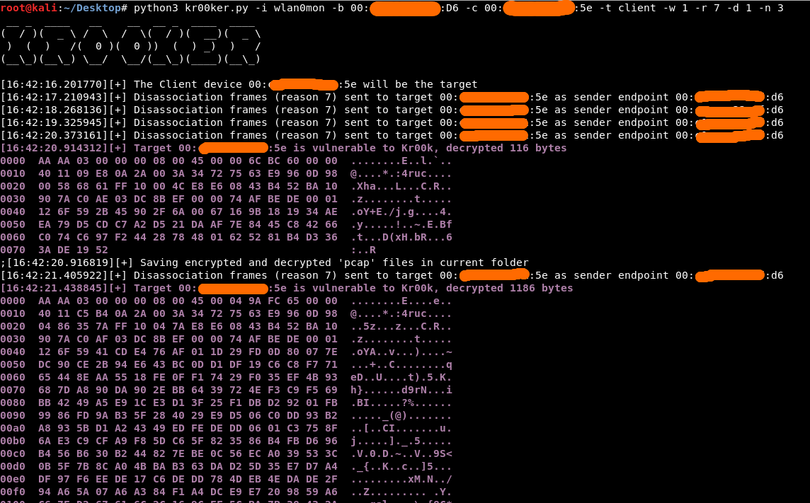

kr00ker
============


# Description 
This script is a simple experiment to exploit the KR00K vulnerability (CVE-2019-15126), 
that allows to decrypt some WPA2 CCMP data in vulnerable devices (Access Point or Clients).
More specifically this script attempts to retrieve decrypted data of WPA2 CCMP packets knowning:
 * the TK (128 bites all zero) 
 * the Nonce (sent plaintext in packet header)
 * the Encrypted Data

 Where:
 * WPA2 AES-CCMP decryption --> AES(Nonce,TK) XOR Encrypted Data = Decrypted Data  
 * Decrypted stream starts with "\xaa\xaa\x03\x00\x00\x00"
 * Nonce (104 bits) = Priority (1byte) + SRC MAC (6bytes) + PN (6bytes)
 
# Preconditions:
This PoC works on WPA2 AES CCMP with Frequency 2.4GHz WLANs. (NOTE: tested only using my wireless adapter TPLINK TL-WN722N, but I think it should work also with other wireless adapters able to inject packets).


# References:
* https://www.welivesecurity.com/wp-content/uploads/2020/02/ESET_Kr00k.pdf


# Limitations
To check the Kr00k vulnerability could be necessary to launch the PoC multiple times, because (it seems that) not always
a sufficient amount of data is buffered on vulnerable devices (hint: try using streaming apps, videocalls, etc.).

# Notes
This script must be run as privileged user and with wireless interface configured in monoitor mode


# Dependencies
The installation of the Python packages "scapy" and "Cryptodome" is required.
The script is compatible with Python 3.


# Usage
Following are reported some usage examples of the tool. You must insert MAC addresses of AP and Client, also is important to set the correct WiFi Channel of the WPA2 CCMP WLAN and to specify the target identifier. 
Use the "--help" option for a more exhaustive list.

```
# python3 kr00ker.py -i <interface-name> -b <BSSID> -c <MAC-client> -n <num-packets> -r <reason-id> -t <target-id> -w <wifi-channel> -d <delay>
```

Some examples below.

Launch the Kr00k attack using interface wlan0mon against the client (-t client) device, with reason 3, delay 2 seconds, number of disassociation frames 5, in the wifi channel 2:
```
# python3 kr00ker.py -i wlan0mon -b XX:XX:XX:XX:XX:XX -c ZZ:ZZ:ZZ:ZZ:ZZ:ZZ -n 5 -r 3 -t client -w 2 -d 2
```

Launch the Kr00k attack using interface wlan0mon against the Access Point (-t ap) device, with default reason 7, default delay 4 seconds, default number of disassociation frames 1, in the wifi channel 11:
```
$ sudo python3 kr00ker.py -i wlan0mon -b XX:XX:XX:XX:XX:XX -c ZZ:ZZ:ZZ:ZZ:ZZ:ZZ -t ap -w 11
```

When the Kr00k vulnerability is triggered on target device the hexdump of decrypted data is shown in output, and also this data is saved on a pcap file.

Following an example of output for a KR00K vulnerable device:




# Author
kr00ker was developed by Maurizio Siddu


# GNU License
Copyright (c) 2020 kr00ker

This program is free software: you can redistribute it and/or modify
it under the terms of the GNU General Public License as published by
the Free Software Foundation, either version 3 of the License, or
(at your option) any later version.

This program is distributed in the hope that it will be useful,
but WITHOUT ANY WARRANTY; without even the implied warranty of
MERCHANTABILITY or FITNESS FOR A PARTICULAR PURPOSE. See the
GNU General Public License for more details.

You should have received a copy of the GNU General Public License
along with this program.  If not, see <http://www.gnu.org/licenses/>

